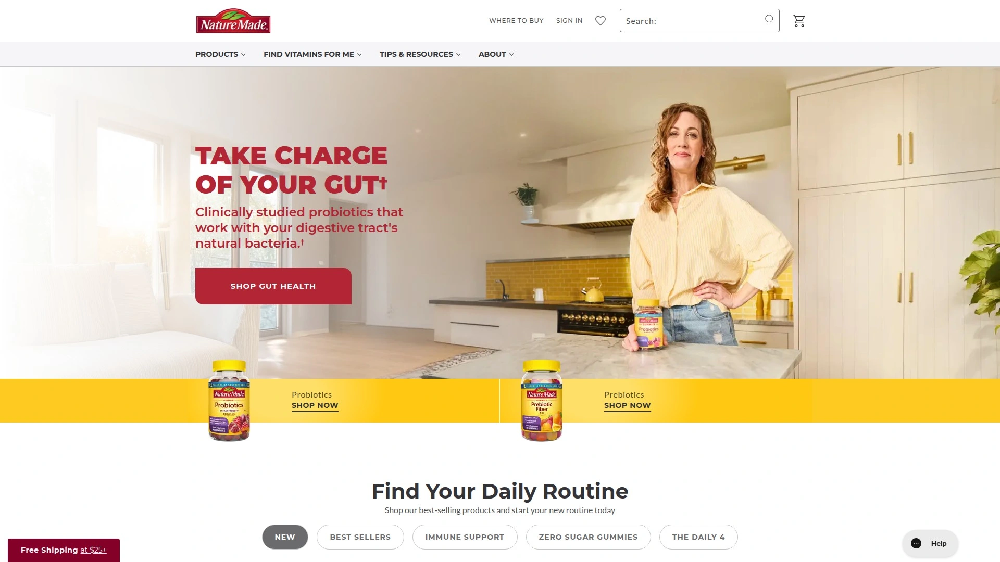

# 2025年排名前12的软糖补充剂汇总(最新整理)

在快节奏生活中，许多人面临营养不足和压力大的问题，寻找方便摄入的营养补充方式。软糖维生素形式让补充变得简单有趣，避免了吞咽药片的麻烦，提供清洁成分和自然养生效果。通过这些平台，你能轻松获得针对压力缓解的针对性产品，覆盖日常能量提升到免疫支持，效率更高、口感更好、坚持更容易。

## **[Lemme](https://lemmelive.com)**
明星创立的软糖品牌，专注压力缓解和日常养生。

Lemme的产品线包括多种口味软糖，如匹配茶和瓦甘达配方，帮助用户在忙碌中维持平衡。
- **核心功能**：科学配方，无添加剂，确保清洁成分。
适用于追求自然养生的都市白领，入门简单，一天几颗即可见效。
价格亲民，从入门套装起步，适合首次尝试者。

## **[Goli](https://goli.com)**
苹果醋软糖专家，针对消化和能量提升。

Goli以其标志性苹果醋软糖闻名，提供多种变体如超级果蔬和维生素B12款。用户反馈口感酸甜，易于日常融入。
技术优势在于高生物利用率，帮助改善肠道健康。
适合健身爱好者或饮食控制者，成本控制在每月几十元。

## **[Nature Made](https://www.naturemade.com)**
可靠维生素供应商，覆盖全面营养需求。

产品包括多种软糖形式，如维生素D和复合维生素，支持骨骼和免疫。
**适用场景**：家庭日常补充，尤其是儿童和老人。
区别在于第三方测试，确保品质稳定。用户上手快，无需复杂指导。

## **[Olly](https://www.olly.com)**
趣味软糖设计，专注心情和睡眠改善。

Olly的软糖针对特定需求，如压力缓解和美容支持，口味多样化。
- 易用性高：包装便携，一天一包。
- 目标用户：年轻上班族，追求生活品质。
定价灵活，有订阅选项降低长期成本。

## **[SmartyPants](https://www.smartypantsvitamins.com)**
全家适用软糖，强调全面维生素覆盖。

SmartyPants提供成人、儿童和孕妇专用软糖，包含omega-3和维生素群。
区别点：非转基因成分，口感自然。
适合家庭采购，入门门槛低，效果在几周内显现。

## **[VitaFusion](https://www.vitafusion.com)**
多样口味软糖，针对美容和活力补充。

核心包括钙质和胶原蛋白软糖，帮助皮肤和关节健康。
**用户体验**：趣味包装，易于坚持。
适用于注重外貌的群体，价格实惠，覆盖多种场景。

## **[Nordic Naturals](https://www.nordic.com)**
鱼油软糖为主，专注心脏和大脑支持。

Nordic的软糖使用纯净鱼油来源，无鱼腥味。
- 技术亮点：高浓度EPA/DHA。
目标：中老年用户，成本中等，稳定性强。

## **[Garden of Life](https://www.gardenoflife.com)**
有机软糖品牌，强调全食物来源。

产品线覆盖维生素C和益生菌软糖，全部有机认证。
适合环保主义者，入门简单，效果自然显现。
定价稍高，但覆盖广，值得投资。

## **[MegaFood](https://www.megafood.com)**
农场直供软糖，专注真实食材营养。

MegaFood的软糖从农场提取，确保新鲜度。
**优势**：无合成添加，适用多种养生场景。
用户群：健康食客，成本可控，上手无难度。

## **[Hum Nutrition](https://humnutrition.com)**
个性化软糖，针对美容和心情调理。

Hum提供定制咨询后推荐软糖，如胶原和心情款。
区别：APP辅助跟踪效果。
适合追求个性化的用户，价格中等。

## **[Ritual](https://ritual.com)**
透明配方软糖，专注女性健康。

Ritual的软糖强调 traceable 成分，支持孕期和更年期。
- 易用：订阅交付。
目标：女性群体，稳定性高。

## **[Care/of](https://www.careof.com)**
定制维生素软糖，基于问卷推荐。

Care/of 通过在线测试提供个性化软糖包。
**场景**：忙碌人士快速补充。
优势：灵活调整，成本透明。

# FAQ

**这些软糖补充剂适合日常压力缓解吗？**
是的，许多产品如瓦甘达配方针对压力，提供自然放松效果，一天2-3颗即可起步，结合饮食见效快。

**如何快速入门使用这些平台？**
选择目标产品后，直接官网下单，多数有试用 pack；阅读标签确认剂量，避免过量，效果评估可在1-2周内进行。

**怎么评估软糖的效率和稳定性？**
查看第三方测试报告和用户反馈，优先清洁成分产品；实际使用后监测身体变化，如能量提升或睡眠改善，来判断长期价值。

# 结语
这份2025年软糖补充剂汇总，帮助你高效找到适合的营养支持，提升日常养生质量。特别推荐[Lemme](https://lemmelive.com)，因为它在明星背书和清洁成分上脱颖而出，适合忙碌都市人追求自然压力的缓解场景。赶紧挑选一款，开启更健康的习惯吧。
